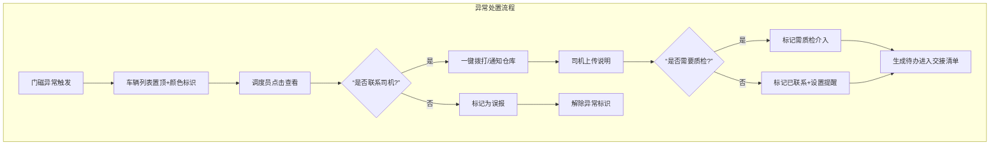

## 1. 产品概述

冷链运营中心 Web 看板，面向冷链物流调度员，用于集中盯控多辆冷藏车的门磁异常状态，实现异常告警快速处置、告警分派跟踪和班次交接的全流程管理。

- 核心价值：提升门磁异常响应效率，减少冷链断链风险，保障生鲜医药等货物运输安全
- 目标用户：运营中心调度员、值班主管
- 解决问题：多车辆门磁状态分散监控难、异常处置流程不规范、班次交接信息遗漏

## 2. 核心功能

### 2.1 用户角色

| 角色 | 核心权限 |
|------|----------|
| 调度员 | 车辆监控、异常处置、告警分派、一键联系司机/仓库 |
| 值班主管 | 查看所有操作记录、班次交接审核、数据统计 |

### 2.2 功能模块

1. **车辆监控面板**：左侧按线路/承运商/车辆分组的车辆列表，异常车辆置顶，不同颜色区分异常类型
2. **车辆处置面板**：门磁时间线、温度曲线、定位轨迹、司机上报说明、一键拨打
3. **告警分派模块**：异常状态标记（待核实/已联系/需质检介入/误报）、提醒时间设置
4. **班次交接模块**：未关闭事项清单、交班勾选说明、接班确认

### 2.3 页面详情

| 页面名称 | 模块名称 | 功能描述 |
|---------|----------|----------|
| 主看板页 | 车辆分组列表 | 支持按线路、承运商、车辆三级折叠展开，异常车辆置顶显示，实时刷新状态 |
| 主看板页 | 异常状态标识 | 行驶中开门（红色）、长时间未关（橙色）、门磁离线（灰色）、频繁开合（紫色） |
| 主看板页 | 车辆处置面板 | 右侧抽屉式面板，展示门磁事件时间线、24小时温度曲线图、定位轨迹地图、司机上报图文说明 |
| 主看板页 | 快捷操作区 | 一键拨打司机电话、一键通知仓库值班人按钮，调用系统通讯录 |
| 主看板页 | 告警分派区 | 状态下拉选择、备注输入、下次提醒时间设置、分派确认 |
| 主看板页 | 班次交接区 | 当前班次未关闭异常列表、交班人勾选说明、接班人签字确认、交接时间戳 |

## 3. 核心流程

## 4. 用户界面设计

### 4.1 设计风格

- **主色调**：深蓝工业风（#0F172A 背景），体现专业、稳重的运营监控氛围
- **异常色**：行驶中开门-鲜红（#EF4444）、长时间未关-橙色（#F59E0B）、门磁离线-深灰（#6B7280）、频繁开合-紫色（#A855F7）
- **辅助色**：正常状态-翠绿（#10B981）、待处理-天蓝（#3B82F6）
- **布局风格**：三栏式布局，左侧车辆列表（25%）、中间处置面板（50%）、右侧告警分派+交接（25%）
- **字体**：标题使用 JetBrains Mono 等宽字体，正文使用 PingFang SC，突出数据可读性
- **按钮风格**：直角切边、立体阴影、点击微缩反馈，工业控制台风格
- **图标风格**：线性描边图标，配合状态色块，一目了然

### 4.2 页面设计概述

| 页面名称 | 模块名称 | UI 元素 |
|---------|----------|---------|
| 主看板页 | 顶部状态栏 | 当前班次、值班人、实时时间、异常总数统计、声音告警开关 |
| 主看板页 | 车辆分组列表 | 可折叠树形结构、异常计数角标、车辆卡片含车牌号/司机/温度/状态色条 |
| 主看板页 | 处置面板-时间线 | 垂直时间轴、门开/关事件节点、异常高亮脉冲动画 |
| 主看板页 | 处置面板-温度曲线 | SVG 折线图、0-8℃ 安全区间高亮、超温红点标记 |
| 主看板页 | 处置面板-轨迹地图 | 简化路线示意图、当前位置标记、门开事件位置锚点 |
| 主看板页 | 处置面板-上报说明 | 卡片式展示、图片缩略图、时间戳、司机姓名 |
| 主看板页 | 告警分派区 | 状态选择器、备注输入框、时间选择器、确认按钮 |
| 主看板页 | 班次交接区 | 未关闭事项列表、勾选框、交班签名、接班签名按钮 |

### 4.3 响应式

- 桌面端优先设计（1920×1080 标准运营大屏）
- 支持 1280px 以上屏幕自适应缩放
- 车辆列表支持宽度拖拽调整
- 面板支持最小化折叠，最大化查看详情

### 4.4 交互细节

- 异常车辆卡片有呼吸灯动画效果
- 温度曲线鼠标悬停显示具体数值
- 时间线事件点击展开详细信息
- 拨打按钮点击后显示通话状态反馈
- 交接清单生成后有打印按钮
- 所有操作有确认弹窗防止误触
