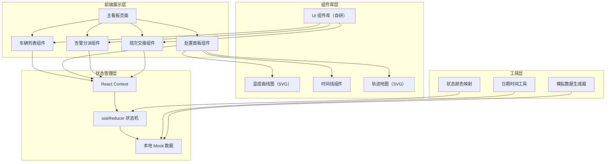
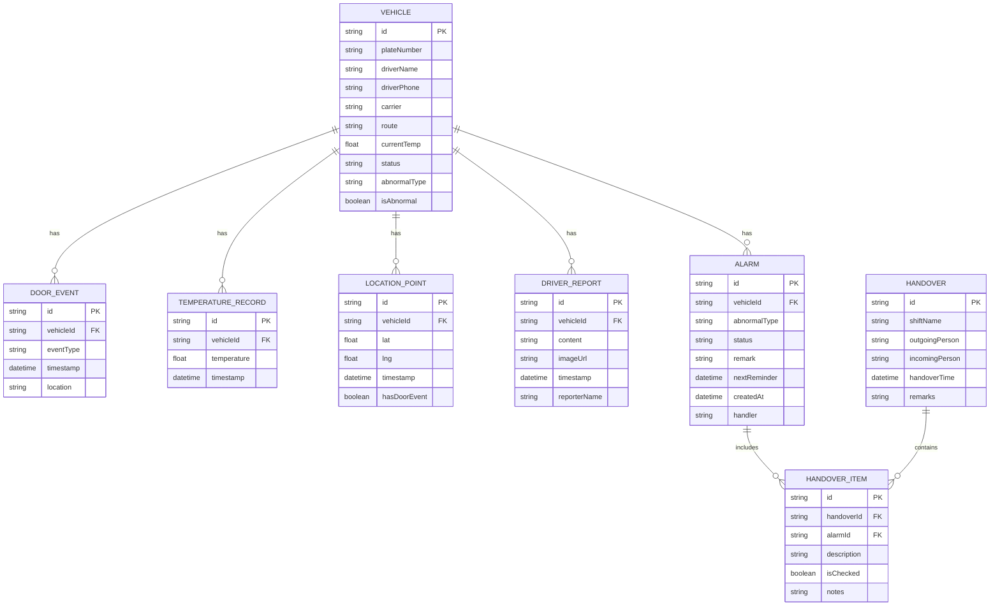

## 1. 架构设计



## 2. 技术描述

- **前端框架**：React@18 + TypeScript
- **构建工具**：Vite@5
- **样式方案**：TailwindCSS@3 + CSS 变量
- **状态管理**：React Context + useReducer
- **图表实现**：原生 SVG 实现温度曲线、轨迹地图
- **图标方案**：Lucide React 图标库
- **后端**：无后端，使用本地 Mock 数据模拟
- **数据持久化**：localStorage 存储告警状态和交接记录

## 3. 目录结构

```
src/
├── components/
│   ├── layout/
│   │   ├── Header.tsx          # 顶部状态栏
│   │   └── ThreeColumnLayout.tsx
│   ├── vehicle-list/
│   │   ├── VehicleList.tsx     # 车辆列表主组件
│   │   ├── RouteGroup.tsx      # 线路分组
│   │   ├── CarrierGroup.tsx    # 承运商分组
│   │   └── VehicleCard.tsx     # 车辆卡片
│   ├── disposal-panel/
│   │   ├── DisposalPanel.tsx   # 处置面板主组件
│   │   ├── DoorTimeline.tsx    # 门磁时间线
│   │   ├── TemperatureChart.tsx # 温度曲线图
│   │   ├── LocationTrack.tsx   # 定位轨迹
│   │   └── DriverReport.tsx    # 司机上报说明
│   ├── alarm-dispatch/
│   │   ├── AlarmDispatch.tsx   # 告警分派主组件
│   │   ├── StatusSelector.tsx  # 状态选择器
│   │   └── ReminderSetter.tsx  # 提醒时间设置
│   └── handover/
│       ├── HandoverPanel.tsx   # 交接面板主组件
│       ├── UnclosedList.tsx    # 未关闭事项清单
│       └── HandoverForm.tsx    # 交接表单
├── context/
│   └── AppContext.tsx          # 全局状态管理
├── types/
│   └── index.ts                # TypeScript 类型定义
├── data/
│   └── mockData.ts             # Mock 数据
├── utils/
│   ├── dateUtils.ts            # 日期工具
│   └── statusUtils.ts          # 状态工具
├── App.tsx
├── main.tsx
└── index.css
```

## 4. 路由定义

| 路由 | 用途 |
|-----|------|
| / | 主看板页面（唯一页面，单页应用） |

## 5. 数据模型

### 5.1 核心数据类型



### 5.2 异常类型枚举

- `DOOR_OPEN_WHILE_DRIVING` - 行驶中开门（红色）
- `DOOR_OPEN_TOO_LONG` - 长时间未关（橙色）
- `SENSOR_OFFLINE` - 门磁离线（灰色）
- `FREQUENT_OPEN_CLOSE` - 频繁开合（紫色）
- `NORMAL` - 正常（绿色）

### 5.3 告警状态枚举

- `PENDING_VERIFY` - 待核实
- `CONTACTED` - 已联系
- `NEED_QC` - 需质检介入
- `FALSE_ALARM` - 误报

## 6. 核心组件数据流

### 6.1 车辆列表数据流

```
AppContext (vehicles, alarms)
    ↓
VehicleList (按线路/承运商分组)
    ↓
RouteGroup (展开/折叠)
    ↓
CarrierGroup (展开/折叠)
    ↓
VehicleCard (显示状态、温度、异常标识)
    ↓ onClick
setSelectedVehicle(vehicle) → 更新 Context
```

### 6.2 告警分派数据流

```
选中车辆
    ↓
AlarmDispatch 组件
    ├→ StatusSelector (选择状态)
    ├→ 备注输入
    ├→ ReminderSetter (设置提醒时间)
    └→ 确认按钮
        ↓
dispatch(updateAlarm) → useReducer
        ↓
更新 Context 中 alarms 数组
        ↓
localStorage 持久化
```

### 6.3 班次交接数据流

```
当前未关闭 alarms
    ↓
HandoverPanel
    ├→ UnclosedList (自动生成清单)
    │   └→ 勾选框 + 备注输入
    ├→ 交班人签名
    └→ 交接确认
        ↓
dispatch(createHandover)
        ↓
生成 HANDOVER 记录 + HANDOVER_ITEM 记录
        ↓
标记相关 alarm 已进入交接流程
```

## 7. 关键技术实现点

1. **实时状态刷新**：使用 `setInterval` 每 30 秒模拟数据刷新，更新车辆状态和温度
2. **呼吸灯动画**：使用 CSS `@keyframes` 实现异常车辆卡片脉冲效果
3. **SVG 温度曲线**：原生 SVG + `polyline` 绘制，支持 hover 显示数值
4. **SVG 轨迹地图**：简化城市路线 SVG，门开事件位置用红色锚点标记
5. **状态持久化**：`useEffect` 监听 alarms 变化，自动同步到 localStorage
6. **响应式三栏布局**：Flexbox + 可拖拽分隔条实现面板宽度调整
